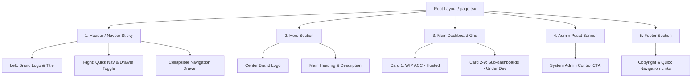

# Dokumen Desain Interface & Layout Portal Cost Control

Dokumen ini berisi spesifikasi desain, tata letak (layout), komponen navigasi (navbar), sistem warna, responsivitas, dan arsitektur visual untuk **Portal Cost Control Dashboard** (`apps/portal`).

---

## 1. Ikhtisar & Tujuan Aplikasi

**Cost Control Dashboard Portal** merupakan pintu gerbang utama (*Single Entry Point*) bagi seluruh manajemen dan tim operasional **Plantation Group 1 (PG1) - Great Giant Pineapple (GGP)** untuk mengakses 9 modul dashboard analisa biaya operasional serta portal administrasi pusat.

### Spesifikasi Teknis Utama:
- **Framework**: Next.js 15 (App Router, Client Components)
- **Styling**: Tailwind CSS & CSS Variables Custom Color Palette
- **Iconography**: `lucide-react`
- **Konfigurasi Navigasi**: Dynamic resolution via `@dashboard/shared-ui` (`getDashboardNavConfig`)

---

## 2. Sistem Warna & Tipografi (Design System)

Desain Portal menggunakan palet warna korporat bernuansa hijau alami (*plantation theme*) dengan kontras tinggi untuk kenyamanan pemantauan data di area perkebunan maupun kantor pusat.

### 2.1 Palet Warna utama:

| Elemen / Role | Kode Warna / Token | Visual & Penggunaan |
| :--- | :--- | :--- |
| **Background Halaman** | `#F7F9F7` | Neutral light sage green background |
| **Text Primary** | `#17231B` | Deep forest dark for headings & main text |
| **Text Secondary** | `#5F6B63` | Muted dark green for descriptions & subtitles |
| **Brand Primary Green** | `#16823B` | GGF Corporate Green (Buttons, Active Icons, Brand Hover) |
| **Brand Primary Hover** | `#126B30` | Darker green for hover states |
| **Border Accent** | `#DDE5DF` | Soft border lines across cards, navbar, & footer |
| **Light Badge / Hover Accent** | `#EAF3EC` | Background icon container & light hover states |
| **Highlight Badge Gold** | `#FCE27A` | Accent badge for active/hosted modules |
| **In-Development Accent** | `bg-amber-50` / `text-amber-700` | Indicator for modules under active development |

### 2.2 Tipografi:
- **Font Family**: Modern Sans-Serif (`font-sans`)
- **Heading 1 (Hero)**: `text-3xl` / `sm:text-4xl`, `font-extrabold`, `tracking-tight`
- **Heading 2 (Card Title)**: `text-lg`, `font-bold`, `tracking-tight`
- **Heading 3 (Section Title)**: `text-lg`, `font-bold`
- **Body & Description**: `text-xs` sampai `text-sm`, `leading-relaxed`

---

## 3. Arsitektur Layout Halaman (`PortalHomePage`)

Halaman portal disusun dengan struktur vertikal fleksibel (`min-h-screen flex flex-col justify-between`) yang terdiri dari 4 bagian utama:

---

## 4. Spesifikasi Detil Komponen Layout

### 4.1 Navbar Sticky (`<header>`)
* **Posisi**: `sticky top-0 z-50`
* **Styling**: `bg-white border-b border-[#DDE5DF] shadow-2xs`
* **Lebar Maksimal**: `max-w-[95%]` terpusat (`mx-auto`)
* **Tinggi Navigasi**: `h-16 sm:h-18`

#### Komponen Navbar:
1. **Logo & Judul Brand (Kiri)**:
   - Gambar logo GGF (`/logo.png`) dengan tinggi responsif (`h-13 sm:h-14`).
   - Teks Utama: "Cost Control Dashboard Portal" (`font-extrabold text-sm sm:text-base`).
   - Sub-teks: "Sistem Informasi Manajemen Estate PG 1" (`text-[10px] sm:text-xs text-[#5F6B63]`).
2. **Tombol Aksi Desktop (Sisi Kanan - `hidden sm:flex`)**:
   - **Portal Utama Estate**: Tombol link external dengan icon `Globe` mengarah ke portal utama estate PG1.
   - **Daftar Dashboard**: Tombol toggle drawer navigasi dengan icon `Menu` / `X`.
   - **Admin Pusat**: Primary CTA button hijau (`bg-[#16823B]`) dengan icon `ShieldCheck`.
3. **Tombol Mobile Menu (Sisi Kanan - `sm:hidden`)**:
   - Single Hamburger toggle button untuk perangkat seluler.

#### Collapsible Navigation Drawer:
- Dipicu oleh state `menuOpen`.
- **Fitur Mobile Quick Links**: Tampil paling atas pada tampilan seluler untuk akses instan ke Portal Estate dan Admin Pusat.
- **Grid Modul (9 Modul)**: Menampilkan list 9 modul dashboard dalam format 3 kolom (`sm:grid-cols-2 md:grid-cols-3 gap-2.5`). Modul aktif dapat di-klik langsung untuk berpindah aplikasi.

---

### 4.2 Hero Section
- **Tampilan Visual**:
  - Logo GGF besar terpusat (`h-16 sm:h-20`).
  - Judul H1: **Cost Control Dashboard Portal** (`text-3xl sm:text-4xl font-extrabold text-[#17231B]`).
  - Paragraf Deskripsi: Penjelasan fungsi portal sebagai pusat pemantauan dan analisis biaya operasional & produksi PG 1.

---

### 4.3 Grid Dashboard Modul (`9 Menu Grid`)
- **Layout Grid**: `grid grid-cols-1 md:grid-cols-2 lg:grid-cols-3 gap-6`
- **Desain Kartu Modul**:
  - **Status Hosted / Aktif (misal: WIP ACC)**:
    - Card border `#DDE5DF`, hover effect border `#CBE0D1` dan bayangan `shadow-md`.
    - Icon Container: Soft green background `#EAF3EC` dengan icon hijau `#16823B`.
    - Badge Tag: Gold highlight `#FCE27A` ("Cost Control").
    - Tombol Aksi: Primary Green Button dengan icon `ArrowRight` ("Buka Menu WIP").
  - **Status Tahap Pembuatan (Sub-modul lainnya)**:
    - Card background subtle gray `bg-slate-50/50`.
    - Icon Container: Soft amber background `bg-amber-50`.
    - Badge Tag: Amber tag ("Tahap Pembuatan").
    - Tombol Aksi: Disabled state dengan icon `Clock`, kursor `not-allowed`, serta custom tooltip bertuliskan *"Masih Pembuatan"*.

---

### 4.4 Banner Admin Pusat
- **Tampilan Visual**:
  - Container putih dengan border hijau tebal pada bagian kiri (`border-l-4 border-l-[#16823B]`).
  - Icon `ShieldCheck` berukuran besar dalam container hijau terang.
  - Teks deskripsi hak akses pengguna, pengelolaan master data, pengunggahan data Excel, dan log aktivitas.
  - Tombol Secondary Action ("Kelola Sistem Admin") mengarah ke `adminUrl`.

---

### 4.5 Footer Section (`<footer>`)
- **Visual**: Background putih, border atas `#DDE5DF`, teks `text-xs text-[#5F6B63]`.
- **Konten**:
  - Hak Cipta: `© 2026 GGF AgroMetric Platform. Enterprise Cost Control Portal.`
  - Navigasi Cepat Inline: Link aktif untuk modul yang sudah live, dan teks ter-disable untuk modul yang masih tahap pembuatan.

---

## 5. Daftar 9 Modul Dashboard Cost Control

Berikut adalah pemetaan 9 modul dashboard yang ada di dalam Portal:

| No | Modul | Subtitle | Badge Category | Status Hosted | Icon |
| :-: | :--- | :--- | :--- | :-: | :--- |
| 1 | **WIP** | Work In Process ACC | Cost Control | ✅ Live | `LineChart` |
| 2 | **HPP** | Harga Pokok Produksi | Produksi | 🚧 Pembuatan | `Banknote` |
| 3 | **Capex** | Capital Expenditure | Belanja Modal | 🚧 Pembuatan | `Building2` |
| 4 | **Opex** | Operational Expenditure | Biaya Operasional | 🚧 Pembuatan | `Receipt` |
| 5 | **Irigasi** | Pengairan & Pump | Fasilitas | 🚧 Pembuatan | `Droplets` |
| 6 | **Sulam** | Pemeliharaan Tanaman | Pemeliharaan | 🚧 Pembuatan | `Sprout` |
| 7 | **Selesai Bongkar** | Land Prep & Ratoon | Land Prep | 🚧 Pembuatan | `Tractor` |
| 8 | **Harga Material** | Master Data Logistik | Master Logistik | 🚧 Pembuatan | `Boxes` |
| 9 | **Poll PG 1** | Armada & Transportasi | Armada PG1 | 🚧 Pembuatan | `Truck` |

---

## 6. Integrasi Dynamic Navigation Config

Portal terintegrasi dengan modul shared UI `@dashboard/shared-ui` melalui fungsi `getDashboardNavConfig()`. Fungsi ini secara dinamis membaca *environment variables* berikut:

- `NEXT_PUBLIC_PORTAL_URL`
- `NEXT_PUBLIC_MAIN_ESTATE_PORTAL_URL`
- `NEXT_PUBLIC_WIP_ACC_URL`
- `NEXT_PUBLIC_HPP_URL`
- `NEXT_PUBLIC_CAPEX_URL`
- `NEXT_PUBLIC_OPEX_URL`
- `NEXT_PUBLIC_IRIGASI_URL`
- `NEXT_PUBLIC_SULAM_URL`
- `NEXT_PUBLIC_SELESAI_BONGKAR_URL`
- `NEXT_PUBLIC_HARGA_MATERIAL_URL`
- `NEXT_PUBLIC_POLL_PG1_URL`
- `NEXT_PUBLIC_ADMIN_URL`

Integrasi ini memastikan bahwa seluruh navigasi antar-aplikasi di dalam monorepo tetap konsisten baik pada environment pengembangan (*local development*) maupun produksi (*production distribution*).

---

## 7. Responsivitas & Adaptabilitas Layar

| Breakpoint | Target Perangkat | Penyesuaian Layout |
| :--- | :--- | :--- |
| `< 640px` (`sm`) | Mobile Phone | Topbar ringkas, Hamburger button tunggal, Drawer menampilkan quick links & 1 kolom modul grid, Hero text `3xl`. |
| `640px - 768px` (`sm - md`) | Tablet Vertical | Action button desktop aktif, Grid Modul Utama 2 Kolom, Drawer 2 Kolom. |
| `>= 1024px` (`lg`) | Desktop & Monitor | Layout penuh, Grid Modul Utama 3 Kolom, Drawer 3 Kolom, max container `95%`. |

---

## 8. Panduan Pemeliharaan & Pengembangan Komponen

1. **Menambah / Mengaktifkan Modul Baru**:
   - Buka `apps/portal/src/app/page.tsx`.
   - Ubah properti `isHosted: true` pada objek modul terkait di dalam array `publicDashboards`.
   - Pastikan URL variabel di `.env` sudah dikonfigurasi dengan port/domain aplikasi yang valid.
2. **Konsistensi Desain**:
   - Selalu gunakan token warna korporat (Heksadesimal `#16823B`, `#17231B`, `#5F6B63`, `#DDE5DF`) dan hindari warna merah/biru standar tanpa persetujuan sistem desain.
